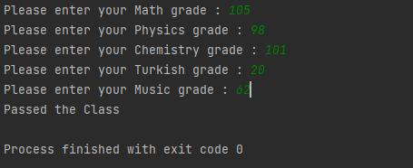

Courses: Mathematics, Physics, Turkish, Chemistry, Music

Passing grade: 55

## Homework
* If the entered course grades are not between 0 and 100, do not include them in the calculation of the average.

